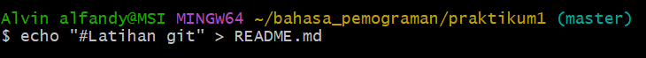

# Tutorial Penggunaan git 
Ini adalah tutorial singkat cara menggunakan git 

## Apa itu git?
Git adalah salah satu sistem pengontrol versi (Version Control System)
pada proyek perangkat lunak yang diciptakan oleh Linus Torvalds.

## Langkah 1 : Instalasi Git
Download Git, buka website resminya Git (git-scm.com)
Kemudian unduh Git sesuai dengan arsitektur komputer kita. Kalau
menggunakan 64bit, unduh yang 64bit. Begitu juga kalau
menggunakan 32bit.
Selamat, Git sudah terinstal di Windows. Untuk mencobanya, silahkan
buka CMD atau PowerShell, kemudian ketik perintah "git --version"

## Langkah 2 : Menambahkan Global  Config
Pada saat pertama kali menggunakan git, perlu dilakukan konfigurasi
user.name dan user.email
konfigurasi ini bisa dilakukan untuk global repostiry atau individual
repository.
apabila belum dilakukan konfigurasi, akan mengakibatkan terjadi kegagalan
saat menjalankan perintah git commit

Config Global Repository
$ git config --global user.name “nama_user”

$ git config --global user.email “nama_user”

contoh

## Langkah 3: Perintah dasar git
Perintah Dasar Git

 git init, perintah untuk membuat repository local
 git add, perintah untuk menambahkan file baru, atau perubahan pada file
pada staging sebelum proses commit.
 git commit, perintah untuk menyimpan perubahan kedalam database git.
 git push -u origin master, perintah untuk mengirim perubahan pada
repository local menuju server repository.
 git clone [url], perintah untuk membuat working directory yang diambil dari
repositry sever.
 git remote add origin [url], perintah untuk menambahkan remote
server/reopsitory server pada local repositry (working directory)
 git pull, perintah untuk mengambil/mendownload perubahan terbaru dari
server repository ke local repository

## Langkah 4 : Membuat Reposiory Local

 Buka direktory aktif, misal: C:\Users\Alvin alfandy\ (buka
menggunakan Windows Explorer)
 klik kanan pada direktory aktif tersebut, dan pilih menu Git Bash,
sehingga muncul git bash commad
 Buat direktory project praktikum pertama dengan nama latihan1
$ mkdir bahasa_pemograman
$ cd bahasa_pemograman

 Jalankan perintah git init, untuk membuat repository local.
$ git init
 Repository baru berhasil di inisialisasi, dengan terbentuknya satu
direktori hidden dengan nama .git
 Pada direktori tersebut, semua perubahan pada working directory
akan disimpan.

## Langkah 5 :  Menambahkan File Baru  pada repository

 Untuk membuat file dapat menggunakan text editor, lalu menyimpan
filenya pada direktori aktif (repository)
 disini kita akan coba buat satu file bernama README.md (text file)
$ echo “# Latihan 1” >> README.md
 File README.md berhasil dibuat.

 Untuk menambahkan file yang baru saja dibuat tersebut gunakan
perintah git add.
$ git add README.md
 File README.md berhasil ditambahkan.

## Langkah 6 : Menambahkan Remote Repository
 Remote Repository merupakan repository server yang akan
digunakan untuk menyimpan setiap perubahan pada local repository,
sehingga dapat diakses oleh banyak user.
 Untuk menambahkan remote repository server, gunakan perintah
git remote add origin [url]
contoh
$ git remote add origin https://github.com/alvinalfandy/latihan_git2

## Langkah 7 : Push (Mengirim perubahan ke server)
 Untuk mengirim perubahan pada local repository ke server gunakan
perintah git push.
$ git push -u origin master
 Perintah ini akan meminta memasukkan username dan password
pada akun github.com

## Nanti akan muncul di github sperti ini 

